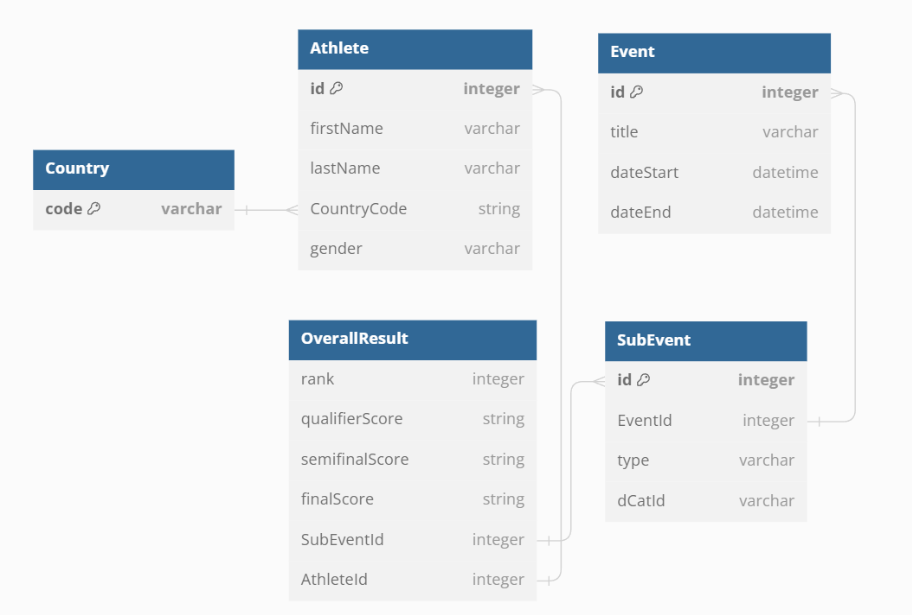

# IFSC Scraper and Data Visualizer

## Overview
This project contains both a backend and frontend component. The backend component is in charge of scraping data from the IFSC website through their API. The API is undocumented so usage was determined by looking through the requests made on the website. Services are then created to show events, athletes and country stats. Athletes can also be selected to compare rankings in different events. The front end component displays the data with tables and graphs.

### Pages
The site is organized into three main pages.

#### Events
The events page shows the list of currently scraped events, ordered by date descending and split by event and their subevents. Only boulder and lead is scraped but this can be updated in the future. Clicking on a subevent will show the overall rankings and scores for each round if available.

#### Athletes
The athletes page shows a list of every athlete that was found during the scraping process and includes their gender, country and medal counts. Clicking on an athlete's name will open a subpage that shows the athlete's information including ranking graph and results. Athletes can also be selected to show a comparison graph of their ranks for each event. This allows a user to easily see how each athlete compares in their progress over time.

#### Countries
The countries page shows a list of every country that was found during the scraping process and includes number of athletes and medal counts.

## App Link
Currently running on free tier of Render so the service shuts down from inactivity. Run backend first then frontend so backend is available when frontend boots back up.

**Backend:** https://ifsc-scraper-service.onrender.com/

**Backend Services:** \
Scrape: https://ifsc-scraper-service.onrender.com/parse \
List of athletes: https://ifsc-scraper-service.onrender.com/athletes \
Athlete Details: [https://ifsc-scraper-service.onrender.com/athletes/:athleteId](https://ifsc-scraper-service.onrender.com/athletes/1147) \
Athlete Comparison: [https://ifsc-scraper-service.onrender.com/compare/athletes?ids=(comma separated athlete ids)](https://ifsc-scraper.onrender.com/compare/athletes?ids=1147,2253) \
List of Countries: https://ifsc-scraper-service.onrender.com/countries \
List of Events: https://ifsc-scraper-service.onrender.com/events \
Event Details: [https://ifsc-scraper-service.onrender.com/events/:eventId/:catId](https://ifsc-scraper.onrender.com/events/1301/3)

**Frontend:** https://ifsc-scraper.onrender.com/

## Technologies Used
| Technology | Use |
| ------------ | ----------|
| Node | 18.14.2 Programming Language |
| Axios | HTTP Client for Javascript |
| Express | Backend Routing |
| ReactJS | Frontend Javascript Library  |
| PostgreSQL | Database |
| Bootstrap | CSS Framework |
| MUI Datatables | Javascript Table Library |
| ChartJS | Javascript Charting Library |

## Scrape Locations
- List of seasons: https://components.ifsc-climbing.org/results-api.php?api=index
- List of events for season: [https://components.ifsc-climbing.org/results-api.php?api=season_leagues_calendar&league=(leagueid)](https://components.ifsc-climbing.org/results-api.php?api=season_leagues_calendar&league=418)
    - leagueid is taken from list of seasons
- Event Results: [https://components.ifsc-climbing.org/results-api.php?api=overall_r_result_complete&event_id=(eventid)&category_id=(categoryid)](https://components.ifsc-climbing.org/results-api.php?api=overall_r_result_complete&event_id=1291&category_id=3)
    - eventid and categoryid is taken from list of events

## Database Schema

## How to Run
For the backend:  
Run `npm install` to install dependencies. Then run `node server.js` to start the server.  
Create a database called `ifsc_scraper` and `ifsc_scraper-test`.  The first is the production database and the second is for running locally and for tests.  
In the browser, go to `localhost:5000/parse` to start the scraper. This will take a while because it is doing many fetches but each event is only scraped once so it will be faster in subsequent runs.  

Run `jest` to run tests.

For the frontend:  
Run `npm install` to install dependencies, then run `npm start` to start the server.
